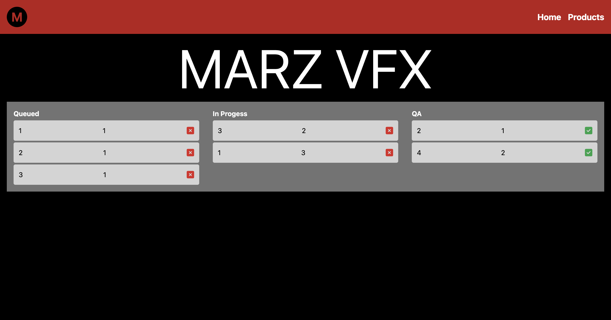
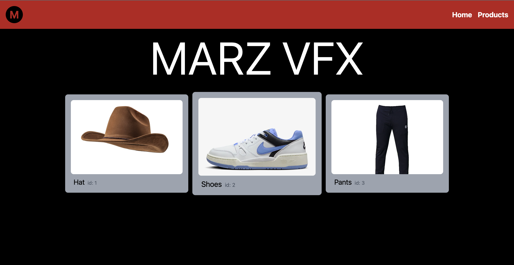
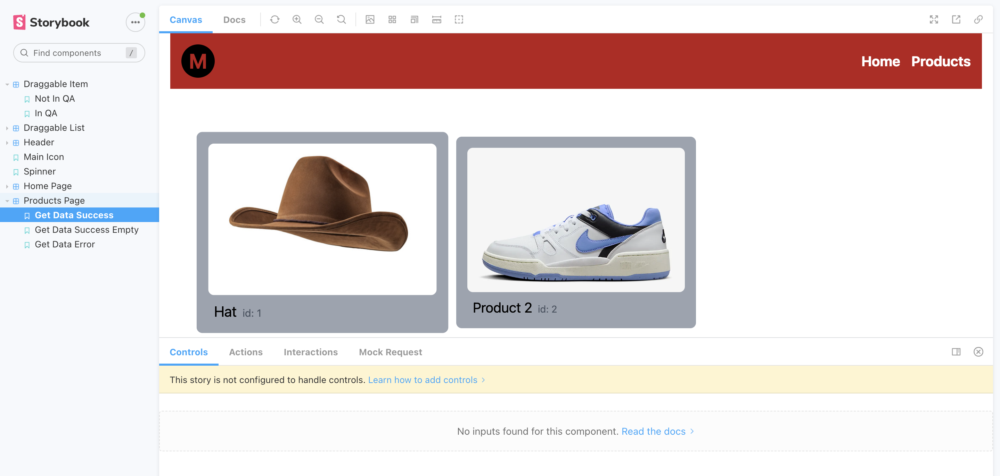

# TODO:

    When the drag ends we want to keep the status persistant across logins.Instead of modifying the data locally we want to do it serverside via a post request

# Approach

To achieve the TODO and keep the order status persistent across logins by updating it server-side, I modified the modify the handleDragEnd function in the <b> HomePage </b> component. Here's how you can update it:

## 1. Modified the handleDragEnd function in HomePage to make a server request:

```typescript
const handleDragEnd = async (result: any) => {
  const { source, destination } = result;
  if (!destination) return;
  const sourceKey = ID_LIST_MAP[
    source.droppableId as keyof IdList
  ] as keyof OrderData;
  const sourceIndex = source.index;

  const destKey = ID_LIST_MAP[
    destination.droppableId as keyof IdList
  ] as keyof OrderData;
  const destIndex = destination.index;

  if (sourceKey === destKey) {
    const sourceClone = Array.from(data[sourceKey]);
    const [removed] = sourceClone.splice(sourceIndex, 1);
    sourceClone.splice(destIndex, 0, removed);
    setData({ ...data, [sourceKey]: sourceClone });
  } else {
    const sourceClone = Array.from(data[sourceKey]);
    const destClone = Array.from(data[destKey]);
    const [removed] = sourceClone.splice(sourceIndex, 1);
    destClone.splice(destIndex, 0, removed);
    destClone[destIndex].OrderStatus = destKey;

    // Updating the states
    setLoadingState(DATA_STATES.waiting);
    const order_status_updates = await updateOrderStatus(removed, destKey);
    if (order_status_updates) {
      setLoadingState(DATA_STATES.loaded);
      setData({
        ...data,
        [sourceKey]: sourceClone,
        [destKey]: destClone,
      });
    }
  }
};
```

## Effect:

Make a server request to update the order status when an item is dragged.
Only update the local state if the server update is successful.
Handle potential errors if the server update fails.

# Approach for api.product microservice

- **Micro-service Development**:
  Created a Flask-based products micro-service with an endpoint /api/products/ to fetch
  and return active products from the database in JSON format. The get_all_products API in the
  products_blueprint executes a SQL query to fetch all active products
  from the Product table, converts the results into a list of dictionaries, and then uses
  ProductSchema to serialize the data. It includes error handling to catch any exceptions and
  return an appropriate error message with a 500 status code if necessary. Upon successful
  retrieval and serialization, the API returns the serialized product data in JSON format
  with a 200 status code. Also added tests for the product API.

- **Database Interaction**:
  Utilized raw SQL queries to fetch data from the Product table.
  Mapped the results to a dictionary and serialized them using Marshmallow's ProductSchema.

- **Containerization**:
  Containerized the micro-service using Docker. Created a Dockerfile for the Flask application,
  specifying the necessary dependencies and configurations.

- **Docker Compose Integration**:
  Added the new container to the docker-compose.yml file, ensuring it runs alongside other services.
  Defined the Flask service, its dependencies, and network settings within Docker Compose.

- **Nginx Configuration**:
  Modified nginx.conf to route traffic to the new micro-service. Added a location block to direct
  requests with the /api/products/ prefix to the Flask container, ensuring proper load balancing
  and traffic management.

## Screenshots




